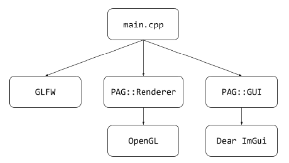

# PAG UJA 2024/25
## Jorge Robles Calvo 77397648P jrc00083
Practicas de Programación de aplicaciones gráficas en la UJA.

## PRÁCTICA 1:
Se pueden controlar los valores de RGB del color de fondo con la rueda del ratón. Después de pulsar las teclas R, G o B si se mueve hacia delante o hacia abajo la rueda del ratón se alterarán los valores respectivos a la última tecla que se pulsó.

## PRÁCTICA 2:
Ahora, utilizando la librería de ImGui, aparecen dos ventanas emergentes en la aplicación. Una muestra los mensajes de los callbacks, los cuales antes aparecían por consola. La otra muestra una rueda de color con la que se puede alterar el color del fondo. La funcionalidad de la práctica 1 sigue estando.

### Clases utilizadas

Las funciones de **OpenGL** han sido encapsuladas en la clase **PAG::Renderer.** De al misma forma, las funciones de **Dear ImGui** que se utilizarán en la aplicación han sido encapsuladas en la clase **PAG::GUI.** Ambas clases siguen el patrón de diseño Singleton. De esta forma, en el main sólo se hacen llamadas a estas clases, a GLFW y a GLAD.



_La aplicación sigue la misma estructura que la estructura propuesta en los guiones de prácticas._

## PRÁCTICA 3:

La clase **PAG::Renderer** contiene ahora dos métodos para la creación de un shader program y un modelo, siendo estos **createShaderProgram()** y **createScene()** respectivamente. El modelo en cuestión es un triángulo equilátero donde cada uno de los vértices tiene el color verde, rojo y azul, siendo el color de cada fragmento una aproximación calculada respecto a la distancia de cada uno. El método **createShaderProgram()** utiliza la función privada **loadShader(shaderLocation)** que toma
 como entrada la localización del shader para cargarlo. En caso de error a la hora de crear tanto el shader program como los shaders, se lanza una excepción que se muetra por la pantalla de mensajes definida en la práctica anterior. Las funciones privadas **shaderCompileErrorExceptionLaucher(GLuint shaderId)** y **shaderProgramCompileErrorExceptionLauncher(GLuint shaderProgramId)** funcionan como medidas de seguridad que lanzan excepciones con los mensajes de error de la compilación de los shaders y el shader program. Tanto el vertex shader como el fragment shader se encuentran en la carpeta *Shaders*.

El proyecto cuenta con dos **VBOs no entrelazados** para la posición y el color y otro **VBO entrelazado** comentado que contiene ambos atributos.

#### Pregunta: Si redimensionas la ventana de la aplicación, verás que el triángulo no permanece igual, sino que se deforma al mismo tiempo que la ventana. ¿A qué crees que se  debe este comportamiento?

Se debe a que al redimensionar la ventana no estamos teniendo en cuenta el *aspect ratio*. Cuando redimensionamos la ventana, no alteramos el aspecto de la cámara para que refleje los cambios, dando como resultado una imagen deformada cuando se estira mucho la ventana. Si el aspecto fuera adaptativo y se correspondiera con el ancho de la ventana entre el alto, la imagen no se deformaría.

## PRÁCTICA 4:

Para el desacoplamiento de los shaders se utilizan dos nuevas clases: **PAG::ShaderProgram** y **ShaderObject.** PAG::ShaderProgram encapsula las funciones necesarias para crear y enlazar un shader program. Cuenta con las funciones definidas en la práctica de error para el lanzamiento de excepciones en caso de errores. Además cuenta con dos punteros a dos objetos **ShaderObject** que corresponden al vertex shader y el fragment shader del programa. PAG::ShaderObject encapsula las funciones necesarias para crear un shader, ya sea un vertex shader o un fragment shader. Para hacer esta distinción se utiliza un tipo enumerado **shaderType** cuyos valores son **VERTEX** y **FRAGMENT.**

### Generar Shader Program

Para poder generar un shader program, la clase PAG::Renderer cuenta con un puntero a un objeto tipo PAG::ShaderProgram el cual instancia cada vez que se quiere crear un nuevo shader program. Después PAG::Renderer llama a la función createShaderProgram de este objeto, pasándole como atributo un string con la parte común de los archivos de los shaders, en este caso si los archivos son "pag03-vs.glsl" y "pag03-fs.glsl" sólo se le pasa la cadena "pag03".
Entonces la clase PAG::ShaderProgram instancia dos shader programs, uno con el valor **VERTEX** en el atributo *type* y el otro con el valor **FRAGMENT**. Según el tipo de shader, cada ShaderObject crea su shader cargando su código glsl correspondiente utilizando la cadena de texto común ya proporcionada. Cuando ambos shaders están creados, PAG::Shader program recibe los ids de estos utilizando la función *getId* de PAG::Shader Object y enlaza el shader program.
Finalmente, PAG::Renderer recibe el id del shader program mediante la función *getIdSp* para utilizarlo en la aplicación.

### Cargar Shader Program mediante interfaz

La clase PAG::GUI contiene una función *drawShaderLoadWindow* que genera una ventana con una entrada de texto y un botón. PAG::Renderer recibe el estado del botón llamando a la función *isShaderLoadButtonPressed* de PAG::GUI, cuando el botón se presiona, recibe el texto de la entrada con la función *getShaderLoadInputText* de PAG::GUI. Si el texto no es vacío, PAG::Renderer destruye la instancia del shader program, el cual destruye sus dos shader objects. Después, crea un nuevo shader program utilizando el texto de entrada como la parte común de los shaders tal y como se explica en el apartado anterior. 

### UML

````plantuml
class OpenGL
class ImGui
class PAG::Renderer{
PAG::ShaderProgram* shaderProgram
}
class PAG::GUI
class PAG::ShaderProgram{
PAG::ShaderObject* vertexShader
PAG::ShaderObject* fragmentShader
}
class PAG::ShaderObject

PAG::Renderer-->PAG::ShaderProgram:instancia
PAG::Renderer-->OpenGL:llama
PAG::Renderer->PAG::GUI:llama
PAG::GUI-->ImGui:llama
PAG::ShaderProgram-->PAG::ShaderObject:instancia
PAG::ShaderProgram->OpenGL:utiliza
PAG::ShaderObject->OpenGL:utiliza

````

## PRÁCTICA 5:

La cámara virtual ha sido implementada con una nueva clase **PAG::Camera**, la cual es instanciada y gestionada por el Renderer. Además, para simplificar el manejo de movimietos de la cámara se utiliza un tipo enumerado **cameraMovementType** que contiene los tipos de movimientos que puede realizar la cámara: ZOOM, PAN, TILT, DOLLY, CRANE y ORBIT. 

Entre los atributos de la cámara se ecuentran:
- Los vectores que definen su **eje de coordenadas:** u,v y n.
- El vector **Y**.
- La **posición** de la cámara, el punto **lookAt** y el vector **up**.
- El **fovY**, el **zNear** y el **zFar**
- El **aspecto**, el cual se calcula cada vez que se redimensiona el  viewport mediante un callback.

### Instrucciones

La cámara puede controlarse de dos maneras, mediante el ratón y la interfaz.

- **Control por ratón**: al pulsar el click derecho del ratón y arrastrar, el ángulo de la cámara cambiará en dirección del movimiento. Es decir, el punto lookAt se mueve.
- **Control por interfaz**: hay una nueva ventana con menú combo donde se muestran las diferentes opciones de movimiento.
  - Zoom: se puede ajustar un zoom mediante un *slider*. Esto simplemente altera el valor de fovY.
  - Tilt/Pan: un slider permite rotar el punto lookAt de la cámara alrededor del el eje v y u de esta, la posición del slider se resetea cuando se suelta. Esto realiza un movimiento de rotación del punto lookAt respecto un eje en concreto, moviendolo al origen de las coordenadas con glm::translate(-cameraPos), rotándolo en el eje  correspondiente con glm::rotate y devolviéndolo a su posición con glm::translate(camerapos).
  - Dolly/Crane: se utilizan botones para mover la cámara trasladando su posición y la del punto lookat. Esto se hace con glm::translate
  - Orbit: similar a Tilt y Pan, pero intercambiando el punto lookAt por la posición de la cámara. Es decir, la cámara rota alrededor del lookAt.

### Funcionamiento

Desde el main, se llaman a las funciones **processUiCameraMovement** y **proscessCameraMovement** de Renderer y se le pasan como argumentos las variables necesarias de GUI y los datos relevantes de la posición del ratón respectivamente. Después el Renderer procesa esos datos y llama a la cámara para que efectue los movimientos necesarios mediante la multiplicación de matrices de transformación. Finalente, se calcula la matriz de visión y se actualiza el sistema de coordenadas de la cámara. Esta matriz de visión es enviada con un *uniform* a el vertex shader.

### UML

````plantuml
class OpenGL
class ImGui
class PAG::Renderer{
PAG::ShaderProgram* shaderProgram
PAG::Camera* camera
}
class PAG::GUI
class PAG::ShaderProgram{
PAG::ShaderObject* vertexShader
PAG::ShaderObject* fragmentShader
}
class PAG::ShaderObject
class PAG::Camera

PAG::Renderer-->PAG::ShaderProgram:instancia
PAG::Renderer-->OpenGL:llama
PAG::Renderer->PAG::GUI:llama
PAG::Renderer->PAG::Camera::instancia
PAG::GUI-->ImGui:llama
PAG::ShaderProgram-->PAG::ShaderObject:instancia
PAG::ShaderProgram->OpenGL:utiliza
PAG::ShaderObject->OpenGL:utiliza
````

## PRÁCTICA 6

En esta práctica se realiza encapsulamiento de los modelos en su propia clase, **PAG::Model**. El renderer se encarga de gestionar estos modelos, guardándolos en una lista de pares donde un elemento es el modelo y el otro el id del shader program asociado. En el ciclo de renderizado, el renderer dibuja los modelos, haciendo uso de sus matrices de modelado respectivas. Para cargar modelos desde un archivo, los modelos hacen uso de **Assimp**, guardando todos los vértices, normales e índices de la escena que se carga. Estos valores son luego utilizados por el Renderer a la hora de crear los VAOs,IBOs y VBOs necesarios.

Entre los atributos del modelo se ecuentran:
- Su matriz de modelado **modelMatrix**.
- Un puntero a los vértices, índices y normales del modelo: **vertices**, **indices** y **normals**.
- El id del VAO del modelo, **idVAO**.
- El id de los VBO de posición y de normales: **idVBO_pos** y **idVBO_normals**.
- El id del IBO del modelo, **idIBO**.

### Instrucciones

Para añadir un nuevo modelo, hay una ventana donde se escribe el nombre del Shader Program a utilizar, el cual se se carga desde la carpeta *./Shaders*, después se pulsa en el botón para cargar el modelo. Este botón abre un explorador de archivos que comienza en el directorio ./Models. Al seleccionar un archivo .obj, se creará un modelo con el shader especificado. El modelo no cargará si el archivo elegido no es .obj o el Shader Program no existe.

Para transformar y gestionar modelos, hay una nueva ventana donde se muestran todos los modelos de la escena. Debajo, se ecuentra otro combo con las transformaciones que se pueden realizar sobre el modelo escogido. Estas transformaciones son Traslación, Rotación y Escalado, las cuales se aplican al modelo escogido al pusar el botón correspondiente, además hay un botón que permite resetear los valores de la transformaciones. Finalmente hay un botón que permite destruir el objeto elegido. El programa empieza con el triángulo por defecto como primer objeto.

### UML

````plantuml
class OpenGL
class ImGui
class Assimp

class PAG::Renderer{
PAG::ShaderProgram* shaderProgram
PAG::Camera* camera
std::vector<std::pair(PAG::Model,GLuint)>* modelList
}
class PAG::GUI
class PAG::ShaderProgram{
PAG::ShaderObject* vertexShader
PAG::ShaderObject* fragmentShader
}
class PAG::ShaderObject
class PAG::Camera
class PAG::Model

PAG::GUI - PAG::Renderer : se comunican por el main

PAG::GUI ..|> ImGui : usa
PAG::Renderer ..|> OpenGL : usa
PAG::Renderer --* PAG::ShaderProgram : contiene
PAG::Renderer --* PAG::Camera : contiene
PAG::Renderer --* PAG::Model : contiene varios

PAG::ShaderProgram --* PAG::ShaderObject : contiene 2
PAG::Model ..|> Assimp : usa
````

## PRÁCTICA 7

En esta práctica se realiza encapsulamiento de los materiales en la nueva clase **PAG::Material**. La clase del modelo ha sido actualizada para contener un material como uno de sus atributos. Los archivos de shader también han sido alterados para que contengan subrutinas que se ativan dependiendo de que el modelo se dibuje en modo *GL_FILL* o en modo *GL_LINE*. Se utiliza un enum, **modelVisualizationTypes{WIREFRAME,FILL}** para facilitar esta distinción.

Entre los atributos del material se ecuentran:
- Los colores ambient, diffuse y specular: **ambient, diffuse, specular**.
- El exponente, **exponent**

### Instrucciones
En la ventana para añadir un modelo de la práctica anterior se ha añadido una rueda de color para elegir el color del material y una casilla para elegir si el modelo debe de ser rellenado o sólo será visualizado como wireframe. Esta misma configuración tambien es añadida en una nueva opción en la ventana de transformaciones para poder transformar el material del un objeto después de haber sido creado.

### Funcionamiento
El Renderer recoje los datos de los controles de interfaz ya mencionados y los utiliza para o bien crear un nuevo material o para editar los valores del material de un modelo en concreto. Actualmente, sólo se utiliza el color ambiente, el cual se envía a los shaders como un uniform. Dependiendo del modo de visualización del modelo, se elige una de las subrutinas del shader y elige el modo de polígonos de OpenGL. En el nuevo shader, **pag07**, la subrutina *colorMaterial* colorea el modelo del color ambiente del material, la subrutina *colorWireframe* lo colorea de negro.

### UML

````plantuml
class OpenGL
class ImGui
class Assimp

class PAG::Renderer{
PAG::ShaderProgram* shaderProgram
PAG::Camera* camera
std::vector<std::pair(PAG::Model,GLuint)>* modelList
}
class PAG::GUI
class PAG::ShaderProgram{
PAG::ShaderObject* vertexShader
PAG::ShaderObject* fragmentShader
}
class PAG::ShaderObject
class PAG::Camera
class PAG::Model
class PAG::Material

PAG::GUI - PAG::Renderer : se comunican por el main

PAG::GUI ..|> ImGui : usa
PAG::Renderer ..|> OpenGL : usa
PAG::Renderer --* PAG::ShaderProgram : contiene
PAG::Renderer --* PAG::Camera : contiene
PAG::Renderer --* PAG::Model : contiene varios
PAG::Model --* PAG::Material : contiene

PAG::ShaderProgram --* PAG::ShaderObject : contiene 2
PAG::Model ..|> Assimp : usa
````